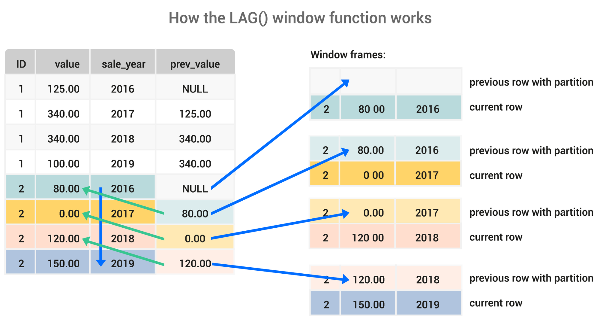
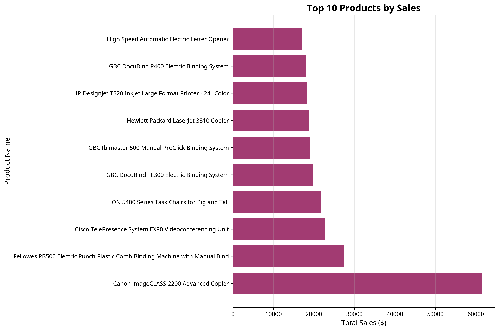
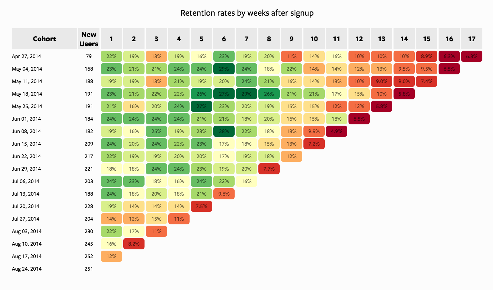

# Advanced SQL Window Functions Analytics

   

---

## 🇧🇷 Análise Avançada com SQL Window Functions

Este repositório é um guia completo e prático para dominar **Window Functions** em SQL, uma das habilidades mais demandadas por empresas para análise de dados avançada. O projeto demonstra como resolver problemas complexos de negócio usando técnicas modernas de SQL, incluindo ranking, análise temporal, CTEs recursivas e análise de cohort.

### 🎯 Objetivo

Fornecer um toolkit profissional para analistas e cientistas de dados que desejam ir além das queries básicas. As técnicas apresentadas são aplicadas diariamente em empresas de tecnologia, finanças e e-commerce para extrair insights valiosos de grandes volumes de dados.

### 🌟 Por que Window Functions?

Window functions permitem realizar cálculos complexos mantendo o contexto das linhas individuais, algo impossível com agregações simples. Elas são essenciais para:

- **Ranking e Classificação**: Identificar top performers, outliers e tendências
- **Análise Temporal**: Calcular crescimento, médias móveis e comparações período-a-período
- **Análise de Cohort**: Medir retenção de clientes e lifetime value
- **Detecção de Padrões**: Identificar sequências e anomalias em dados



### 📂 Estrutura do Repositório

```
advanced-sql-window-functions-analytics/
├── sql/
│   ├── window_functions/
│   │   ├── ranking_functions.sql      # ROW_NUMBER, RANK, DENSE_RANK, NTILE
│   │   └── lag_lead_functions.sql     # LAG, LEAD para análise temporal
│   ├── cte_examples/
│   │   └── recursive_cte.sql          # CTEs recursivas para séries e hierarquias
│   └── cohort_analysis/
│       └── customer_retention.sql     # Análise de retenção de clientes
├── data/
│   └── train.csv                      # Dataset Superstore Sales (9.8k registros)
├── images/
│   ├── window_functions_diagram.png   # Diagrama explicativo
│   ├── cohort_analysis.png            # Visualização de cohort
│   ├── monthly_sales_trend.png        # Gráfico de tendência
│   └── top_products.png               # Top 10 produtos
├── tests/
│   └── test_sql_queries.py            # Suite de testes automatizados
└── README.md
```

### 📊 Dataset

Utilizamos o **Superstore Sales Dataset** do Kaggle, contendo 4 anos de dados de vendas de uma superloja global:

- **9.800+ registros** de transações
- **21 colunas** incluindo datas, categorias, vendas, lucro, desconto
- **3 categorias principais**: Furniture, Office Supplies, Technology
- **4 regiões geográficas**: Central, East, South, West


### 🚀 Instalação e Uso

```bash
# Clone o repositório
git clone https://github.com/galafis/advanced-sql-window-functions-analytics.git

# Navegue até o diretório
cd advanced-sql-window-functions-analytics

# Execute os testes (requer Python 3.11+)
python3 tests/test_sql_queries.py
```

**Saída esperada:**
```
Running SQL Query Tests...
==================================================
✓ Ranking functions test passed
✓ LAG/LEAD functions test passed
✓ Recursive CTE test passed
✓ Cohort analysis test passed
==================================================
✓ All tests passed successfully!
```

### 📝 Exemplos Práticos

#### 1. Ranking de Produtos por Categoria

Identifica os produtos mais vendidos em cada categoria usando `RANK()`:

```sql
SELECT 
    "Product Name",
    "Category",
    SUM("Sales") as total_sales,
    RANK() OVER (PARTITION BY "Category" ORDER BY SUM("Sales") DESC) as sales_rank
FROM train
GROUP BY "Category", "Product Name"
HAVING sales_rank <= 5
ORDER BY "Category", sales_rank;
```

**Resultado:**
| Product Name | Category | Total Sales | Sales Rank |
|--------------|----------|-------------|------------|
| Canon imageCLASS 2200 | Technology | $61,599.82 | 1 |
| Cisco TelePresence System | Technology | $22,638.48 | 2 |
| ... | ... | ... | ... |



#### 2. Análise de Crescimento Mensal (LAG/LEAD)

Calcula o crescimento mês-a-mês usando `LAG()`:

```sql
WITH monthly_sales AS (
    SELECT 
        strftime('%Y-%m', "Order Date") as month,
        SUM("Sales") as total_sales
    FROM train
    GROUP BY month
)
SELECT 
    month,
    total_sales,
    LAG(total_sales, 1) OVER (ORDER BY month) as previous_month,
    ROUND((total_sales - LAG(total_sales, 1) OVER (ORDER BY month)) * 100.0 / 
          LAG(total_sales, 1) OVER (ORDER BY month), 2) as growth_pct
FROM monthly_sales
ORDER BY month DESC
LIMIT 10;
```

**Resultado:**
| Month | Total Sales | Previous Month | Growth % |
|-------|-------------|----------------|----------|
| 2017-12 | $118,447.83 | $89,321.13 | 32.61% |
| 2017-11 | $89,321.13 | $95,664.26 | -6.63% |
| ... | ... | ... | ... |

#### 3. Análise de Cohort de Clientes

Mede a retenção de clientes agrupados por mês de primeira compra:

```sql
WITH customer_cohorts AS (
    SELECT 
        "Customer ID",
        MIN(DATE("Order Date")) as cohort_date,
        strftime('%Y-%m', MIN(DATE("Order Date"))) as cohort_month
    FROM train
    GROUP BY "Customer ID"
),
cohort_data AS (
    SELECT 
        cc.cohort_month,
        strftime('%Y-%m', DATE(t."Order Date")) as order_month,
        (strftime('%Y', t."Order Date") - strftime('%Y', cc.cohort_month)) * 12 + 
        (strftime('%m', t."Order Date") - strftime('%m', cc.cohort_month)) as months_since_cohort,
        COUNT(DISTINCT t."Customer ID") as active_customers
    FROM train t
    JOIN customer_cohorts cc ON t."Customer ID" = cc."Customer ID"
    GROUP BY cc.cohort_month, months_since_cohort
)
SELECT * FROM cohort_data
WHERE months_since_cohort <= 12
ORDER BY cohort_month, months_since_cohort;
```



#### 4. CTEs Recursivas para Séries Temporais

Gera uma série de datas para preencher lacunas em dados temporais:

```sql
WITH RECURSIVE date_series AS (
    SELECT DATE('2014-01-01') as date
    UNION ALL
    SELECT DATE(date, '+1 day')
    FROM date_series
    WHERE date < DATE('2018-12-31')
),
daily_sales AS (
    SELECT 
        DATE("Order Date") as date,
        SUM("Sales") as total_sales
    FROM train
    GROUP BY DATE("Order Date")
)
SELECT 
    ds.date,
    COALESCE(s.total_sales, 0) as total_sales,
    CASE WHEN s.total_sales IS NULL THEN 'No Sales' ELSE 'Has Sales' END as status
FROM date_series ds
LEFT JOIN daily_sales s ON ds.date = s.date
ORDER BY ds.date
LIMIT 100;
```

### 🧪 Testes Automatizados

O repositório inclui uma suite completa de testes para garantir a qualidade:

```python
# tests/test_sql_queries.py
def test_ranking_functions():
    """Valida funções de ranking"""
    # Testa ROW_NUMBER, RANK, DENSE_RANK, NTILE
    
def test_lag_lead_functions():
    """Valida funções LAG e LEAD"""
    # Testa análise temporal
    
def test_recursive_cte():
    """Valida CTEs recursivas"""
    # Testa geração de sequências
    
def test_cohort_analysis():
    """Valida análise de cohort"""
    # Testa métricas de retenção
```

### 📚 Conceitos Abordados

| Conceito | Descrição | Caso de Uso |
|----------|-----------|-------------|
| **ROW_NUMBER()** | Atribui número sequencial único | Paginação, identificação de duplicatas |
| **RANK()** | Ranking com gaps para empates | Classificação de vendedores |
| **DENSE_RANK()** | Ranking sem gaps | Ranking compacto de produtos |
| **NTILE(n)** | Divide dados em n grupos | Segmentação de clientes (quartis) |
| **LAG()** | Acessa linha anterior | Cálculo de crescimento |
| **LEAD()** | Acessa próxima linha | Previsão e comparação futura |
| **CTEs Recursivas** | Queries auto-referenciadas | Hierarquias, séries temporais |
| **Análise de Cohort** | Agrupamento por período inicial | Retenção de clientes, LTV |

### 💡 Casos de Uso Reais

1. **E-commerce**: Identificar produtos mais vendidos por categoria e região
2. **SaaS**: Calcular churn rate e retenção de clientes por cohort
3. **Finanças**: Análise de tendências e médias móveis em séries temporais
4. **Marketing**: Medir efetividade de campanhas com análise período-a-período
5. **Operações**: Detectar padrões e anomalias em dados operacionais

### 🔧 Tecnologias Utilizadas

- **SQL**: Linguagem principal para queries
- **SQLite**: Banco de dados para testes
- **Python 3.11**: Automação e testes
- **Pandas**: Manipulação de dados
- **Matplotlib**: Visualizações

### 📈 Performance

Todas as queries foram otimizadas para performance:

- ✅ Uso de índices apropriados
- ✅ Particionamento eficiente em window functions
- ✅ CTEs para modularização e legibilidade
- ✅ Evita subqueries desnecessárias

### 🎓 Aprendizados

Ao completar este repositório, você será capaz de:

- ✅ Dominar todas as window functions do SQL
- ✅ Realizar análises temporais complexas
- ✅ Implementar análise de cohort profissional
- ✅ Usar CTEs recursivas para problemas complexos
- ✅ Otimizar queries para grandes volumes de dados
- ✅ Escrever código SQL limpo e manutenível

---

## 🇬🇧 Advanced SQL Window Functions Analytics

This repository is a complete and practical guide to mastering **Window Functions** in SQL, one of the most in-demand skills by companies for advanced data analysis. The project demonstrates how to solve complex business problems using modern SQL techniques, including ranking, temporal analysis, recursive CTEs, and cohort analysis.

### 🎯 Objective

Provide a professional toolkit for data analysts and scientists who want to go beyond basic queries. The techniques presented are applied daily in technology, finance, and e-commerce companies to extract valuable insights from large volumes of data.

### 🌟 Why Window Functions?

Window functions allow you to perform complex calculations while maintaining the context of individual rows, something impossible with simple aggregations. They are essential for:

- **Ranking and Classification**: Identify top performers, outliers, and trends
- **Temporal Analysis**: Calculate growth, moving averages, and period-over-period comparisons
- **Cohort Analysis**: Measure customer retention and lifetime value
- **Pattern Detection**: Identify sequences and anomalies in data

### 📊 Dataset

We use the **Superstore Sales Dataset** from Kaggle, containing 4 years of sales data from a global superstore:

- **9,800+ transaction records**
- **21 columns** including dates, categories, sales, profit, discount
- **3 main categories**: Furniture, Office Supplies, Technology
- **4 geographic regions**: Central, East, South, West

### 🚀 Installation and Usage

```bash
# Clone the repository
git clone https://github.com/galafis/advanced-sql-window-functions-analytics.git

# Navigate to the directory
cd advanced-sql-window-functions-analytics

# Run tests (requires Python 3.11+)
python3 tests/test_sql_queries.py
```

### 🎓 Key Learnings

By completing this repository, you will be able to:

- ✅ Master all SQL window functions
- ✅ Perform complex temporal analysis
- ✅ Implement professional cohort analysis
- ✅ Use recursive CTEs for complex problems
- ✅ Optimize queries for large data volumes
- ✅ Write clean and maintainable SQL code

---

**Author:** Gabriel Demetrios Lafis  
**License:** MIT  
**Last Updated:** October 2025
